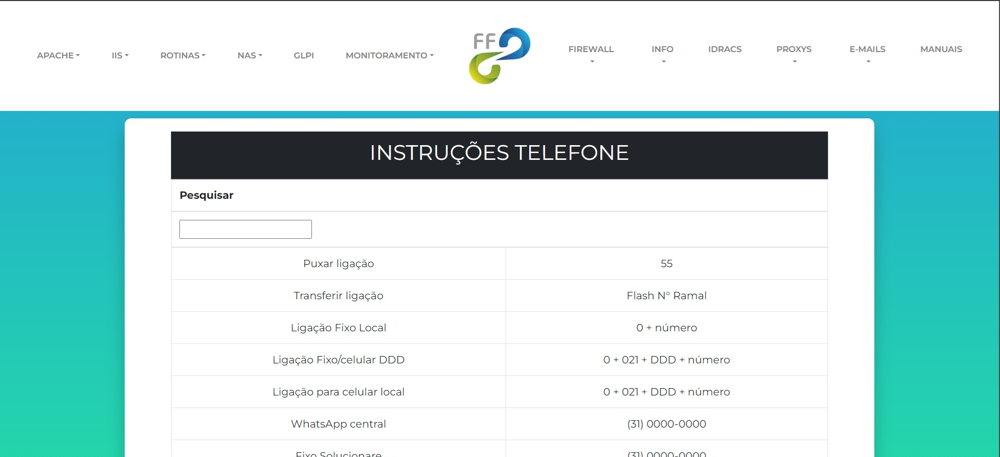
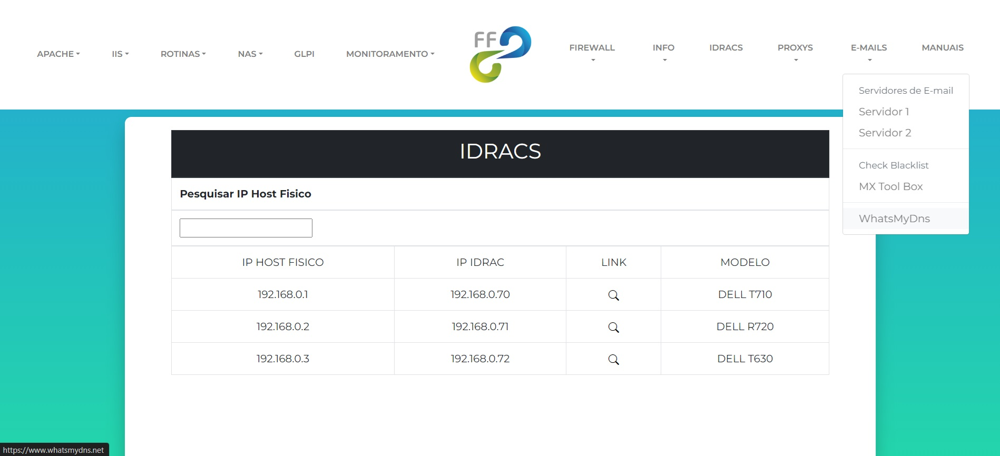
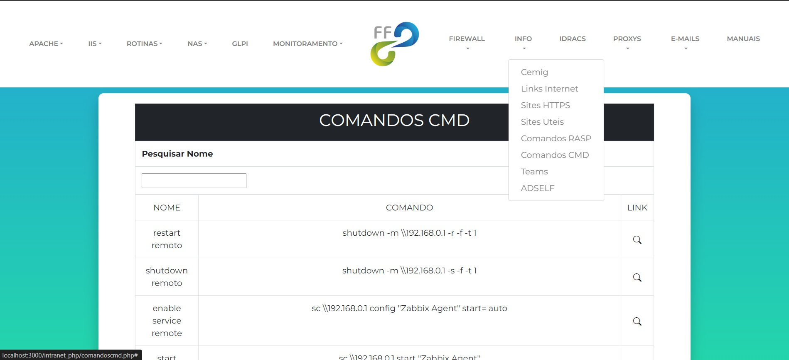

# Intranet

* Este modelo foi desenvolvido em php, html e css. Para sua customização será necessário um pouco de
conhecimento de html e css.

## Menus

* O arquivo de edição dos menus está na pasta template >  header.php

## Docs

* Os arquivos docs que estão na pasta `docs` são arquivos csv onde é utilizada a função
function > function-csv.php para exibir os dados do arquivo na pagina da intranet.

## Imagens da Pagina

  

  
  
  